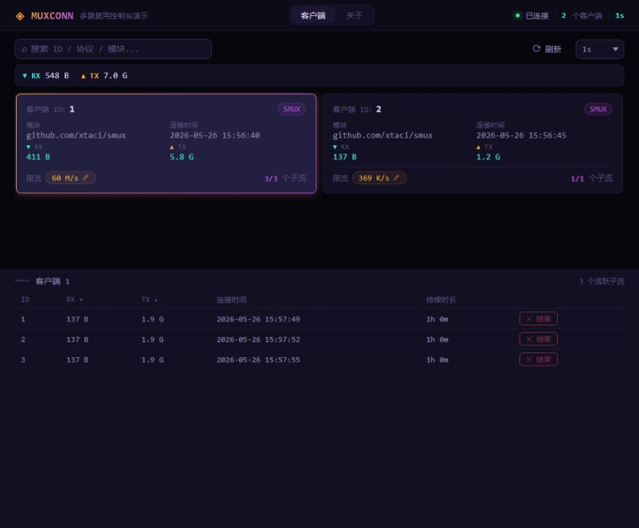

# MUXCONN·多路复用控制台

基于 [muxconn](https://github.com/xmx/muxconn) 的演示项目，展示如何将多个客户端的子流多路复用到一条连接上。

## 快速开始

```bash
# 启动服务端
go run ./cmd/server

# 启动一个或多个客户端（新开终端）
go run ./cmd/client

# 打开浏览器
http://localhost:9999
```

## 限流测试

> 客户端上线后，通过服务端代理下载大文件测试限流效果。

```bash
# Linux/macOS
curl -L "http://127.0.0.1:9999/api/direct/api/download?id={CLIENT_ID}" -o /dev/null

# Windows (注意：命令一定要是 curl.exe 而不是 curl)
curl.exe -L "http://127.0.0.1:9999/api/direct/api/download?id={CLIENT_ID}" -o NUL
```

然后在浏览器页面调整限流值，实时观察下载速度变化，验证限流效果。

## 截图



## API

| 接口                                    | 说明                          |
|---------------------------------------|-----------------------------|
| `GET /api/clients`                    | 获取所有客户端状态                   |
| `GET /api/limit?id={id}&limit={rate}` | 设置客户端限流（如 `10M`、`1G`、`inf`） |
| `GET /api/kill?id={id}&sid={sid}`     | 结束指定子流                      |
| `GET /api/tunnel`                     | 客户端 WebSocket 接入端点          |
| `GET /api/direct/{path}?id={id}`      | 直连客户端内部 HTTP 服务             |

## 目录结构

```
├── cmd/
│   ├── server/       # 服务端
│   └── client/       # 客户端
├── html/             # Web 页面
├── go.mod
└── go.sum
```
